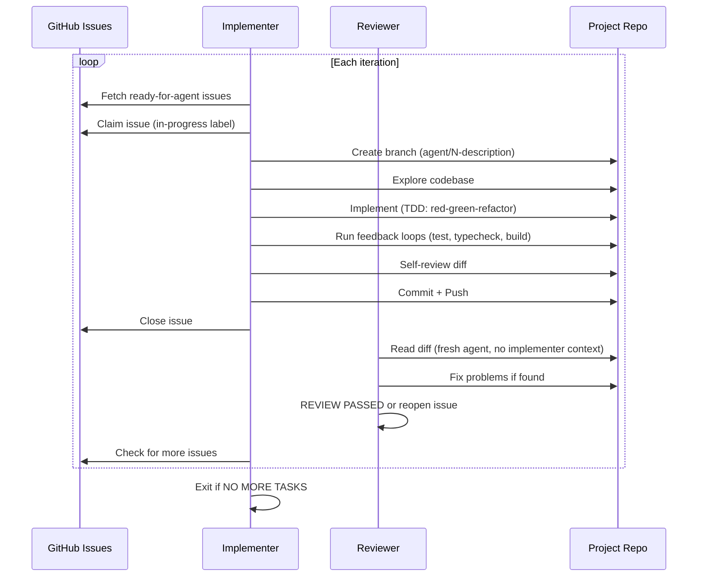

# Ralph Loop

The Ralph loop is the autonomous implementation engine. It picks up issues labeled `ready-for-agent` and implements them without human supervision.

## How it works

## Iteration lifecycle

Each Ralph iteration follows this exact sequence:

1. **Context injection** — collect last 5 commits + `ready-for-agent` issues
2. **Task selection** — pick highest-priority unblocked issue
3. **Claim** — add `in-progress` label (coordinates with other agents)
4. **Branch** — `git checkout -b agent/<N>-<description>`
5. **Explore** — read repo structure, `CONTEXT.md`, `docs/adr/`
6. **Validate** — check the issue is a vertical slice, not horizontal
7. **Implement** — using `/skill:tdd` (red-green-refactor)
8. **Feedback loops** — tests, typecheck, build must all pass
9. **Self-review** — review own diff for dead code, magic values, etc.
10. **Commit** — conventional commit format
11. **Push** — push branch to origin
12. **Close issue** — only if all acceptance criteria met
13. **Review** — a fresh agent reviews the diff, fixes problems or reopens
14. **Next iteration** — loop back for more issues

### Review phase

After the implementer commits and closes the issue, a **separate Pi session** fires with `review-prompt.md`:

- **Fresh agent** — no memory of what the implementer intended
- Sees only the diff and the issue description
- Evaluates: correctness, test coverage, error handling, dead code, security
- If fixable: fixes, commits, pushes, outputs `REVIEW PASSED`
- If critical and unfixable: reverts, reopens the issue, re-labels `ready-for-agent`, outputs `REVIEW FAILED`

Skip the review phase with `ralph/afk.sh 5 zai/glm-5.1 noreview`.

### Merge phase

After all agents finish, `/ralph merge` or `ralph/merge.sh`:

1. Creates `agent/merge-batch-<date>` from base branch
2. Merges each `agent/*` branch one at a time
3. Runs tests after each merge
4. Resolves conflicts
5. Pushes the merge branch
6. Cleans up merged branches

You then review and accept into main manually. The merge agent never touches the base branch.

## Priority order

1. Issues with no blockers (unblock others first)
2. Critical bugfixes
3. Development infrastructure
4. Tracer bullets for new features
5. Polish and quick wins
6. Refactors

## Safety mechanisms

- **Never commits on main/staging** — always creates a branch
- **Feedback loops required** — tests + typecheck + build must pass before commit
- **Self-review** — agent reviews its own diff
- **Separate reviewer** — fresh agent with no sunk-cost bias reviews the code
- **Stale recovery** — `/ralph recover` un-claims `in-progress` issues when no agents are running (checked via tmux sessions, no false positives)
- **Horizontal slice rejection** — agent refuses to implement horizontal issues and flags them back to `needs-triage`
- **Merge branch isolation** — `/ralph merge` never touches the base branch directly
- **Issue closure by implementer** — issues are closed immediately so blockers resolve for other agents

## See also

- [Architecture](architecture.md) — Docker, worktrees, tmux, data flow
- [Prompt](prompt.md) — the full iteration prompt
- [Scripts](scripts.md) — `afk.sh`, `afk-local.sh`, `once.sh`, `merge.sh`
