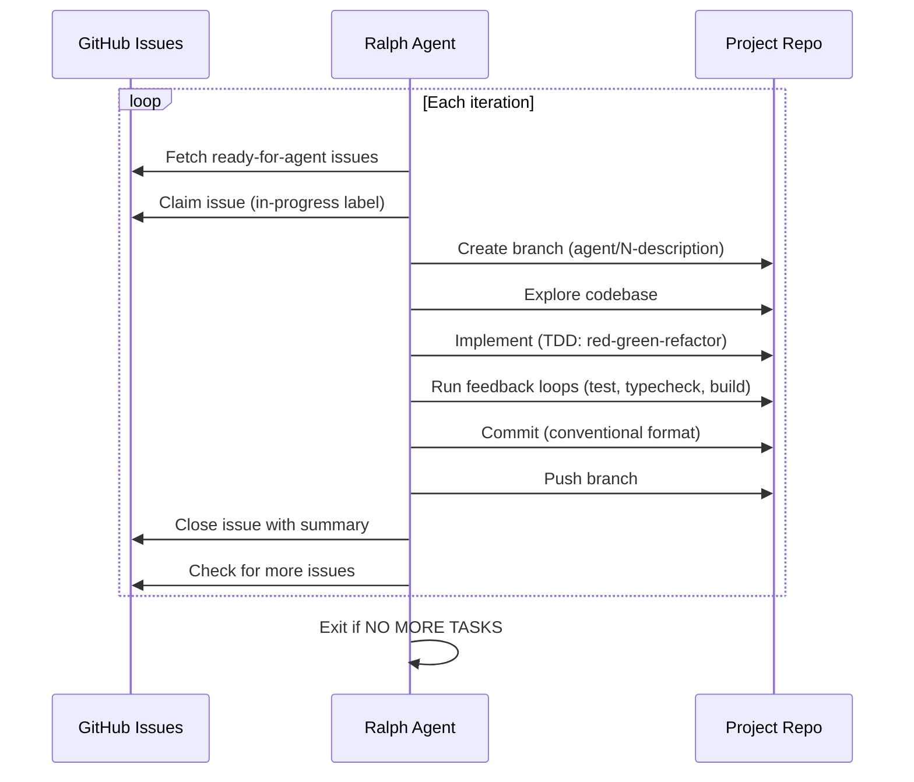

# Ralph Loop

The Ralph loop is the autonomous implementation engine. It picks up issues labeled `ready-for-agent` and implements them without human supervision.

## How it works

## Iteration lifecycle

Each Ralph iteration follows this exact sequence:

1. **Context injection** — collect last 5 commits + `ready-for-agent` issues
2. **Task selection** — pick highest-priority unblocked issue
3. **Claim** — add `in-progress` label (coordinates with other agents)
4. **Branch** — `git checkout -b agent/<N>-<description>`
5. **Explore** — read repo structure, `CONTEXT.md`, `docs/adr/`
6. **Validate** — check the issue is a vertical slice, not horizontal
7. **Implement** — using `/skill:tdd` (red-green-refactor)
8. **Feedback loops** — tests, typecheck, build must all pass
9. **Self-review** — review own diff for dead code, magic values, etc.
10. **Commit** — conventional commit format
11. **Push** — push branch to origin
12. **Close issue** — only if all acceptance criteria met

## Priority order

1. Issues with no blockers (unblock others first)
2. Critical bugfixes
3. Development infrastructure
4. Tracer bullets for new features
5. Polish and quick wins
6. Refactors

## Safety mechanisms

- **Never commits on main/staging** — always creates a branch
- **Feedback loops required** — tests + typecheck + build must pass before commit
- **Self-review** — agent reviews its own diff
- **Stale recovery** — if an agent crashes, the next one un-claims the issue
- **Horizontal slice rejection** — agent refuses to implement horizontal issues

## See also

- [Architecture](architecture.md) — Docker, worktrees, tmux
- [Prompt](prompt.md) — the full iteration prompt
- [Scripts](scripts.md) — `afk.sh`, `afk-local.sh`, `once.sh`
