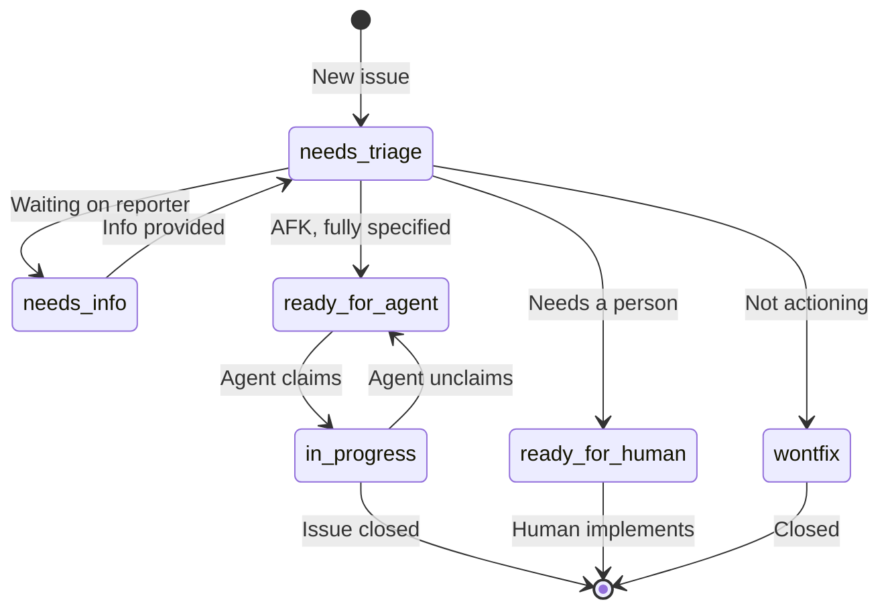

# Triage State Machine

Issues flow through a state machine driven by triage labels.

## States

## Labels

| Label | Color | Description |
|---|---|---|
| `needs-triage` | `#EDEDED` | Needs evaluation by maintainer |
| `needs-info` | `#BFD4F2` | Waiting on reporter for more information |
| `ready-for-agent` | `#0E8A16` | Fully specified, ready for autonomous AFK agent |
| `ready-for-human` | `#FBCA04` | Needs human implementation |
| `in-progress` | `#B60205` | Currently being worked on by an agent |
| `wontfix` | `#FFFFFF` | Will not be actioned |

## Category roles

Each issue also gets a category:

- **`bug`** — something is broken
- **`enhancement`** — new feature or improvement

## Agent brief

When an issue is moved to `ready-for-agent`, the triage skill writes an **agent brief** as a comment:

- **Behavioral** — describes *what* to implement, not *how*
- **Durable** — no file paths or line numbers
- **Concrete** — has acceptance criteria
- **Blocked by** — references other issues that must be closed first

## Out-of-scope

Rejected features are recorded in `.out-of-scope/` with the reason for rejection. When a similar request comes in later, the agent surfaces the prior decision.
