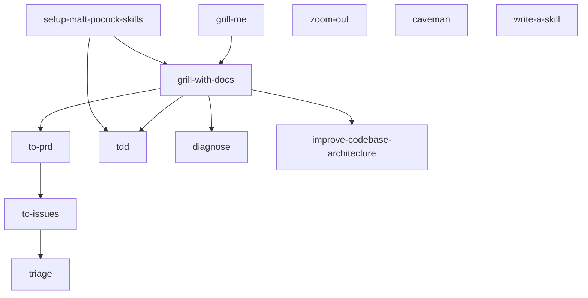

# Skills

14 reusable workflow skills installed at `~/.pi/agent/skills/`. Invoke any skill with `/skill:<name>` inside Pi.

## Skill dependency graph

## Categories

### Productivity

| Skill | Command | One-liner |
|---|---|---|
| [Caveman](caveman.md) | `/skill:caveman` | Ultra-compressed communication, ~75% fewer tokens |
| [Grill Me](grill-me.md) | `/skill:grill-me` | Interview you relentlessly about a plan |
| [Write a Skill](write-a-skill.md) | `/skill:write-a-skill` | Create new skills with proper structure |

### Engineering

| Skill | Command | One-liner |
|---|---|---|
| [Grill with Docs](grill-with-docs.md) | `/skill:grill-with-docs` | Grill + build CONTEXT.md + ADRs |
| [To PRD](to-prd.md) | `/skill:to-prd` | Synthesize conversation into a PRD |
| [To Issues](to-issues.md) | `/skill:to-issues` | Break PRD into vertical slice issues |
| [Triage](triage.md) | `/skill:triage` | Manage issues through state machine |
| [TDD](tdd.md) | `/skill:tdd` | Red-green-refactor loop |
| [Diagnose](diagnose.md) | `/skill:diagnose` | Disciplined bug diagnosis loop |
| [Improve Architecture](improve-codebase-architecture.md) | `/skill:improve-codebase-architecture` | Find deepening opportunities |
| [Zoom Out](zoom-out.md) | `/skill:zoom-out` | Step back and see the whole system |
| [Review Commit](review-commit.md) | `/skill:review-commit` | Automated self-review of the last commit |
| [Review Issue](review-issue.md) | `/skill:review-issue` | Validate that an issue is a proper vertical slice |
| [Setup](setup-matt-pocock-skills.md) | `/skill:setup-matt-pocock-skills` | One-time per-project setup |
